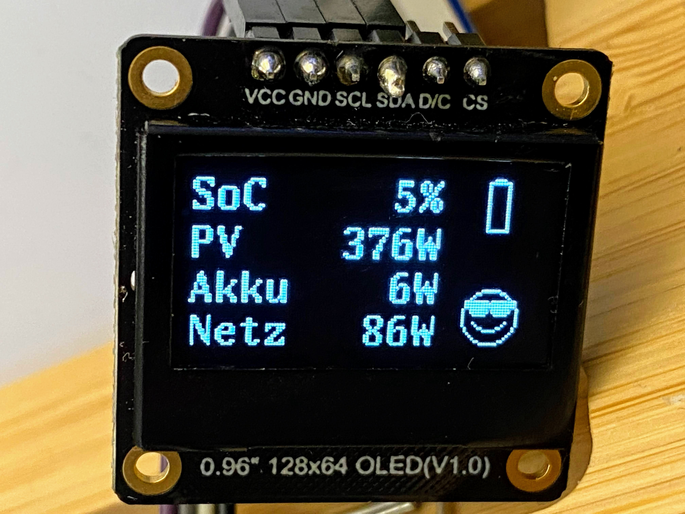

# Kostal Plenticore Converter Monitor

Project of [2022 ESP32 Initiation Program: "Micro-Control" Your World](https://community.dfrobot.com/makelog-312165.html).

This is a ESP32 based device that can be used to monitor the power usage of a Kostal Plenticore converter:

* Battery SoC (0-100%)
* Own home consumption from PV (W)
* Own home consumption from grid (W)
* Own home consumption from battery (W)

Data is shown on 0.96" OLED display:

## Parts List (BOM)

* [DFRobot Monochrome 0.96" 128x64 I2C/SPI OLED Display](https://www.dfrobot.com/product-2017.html)
* [DFRobot Gravity: IO Shield for FireBeetle M0 and ESP32-E](https://www.dfrobot.com/product-2395.html)
* [DFRobot FireBeetle ESP32-E IoT Microcontroller with Header](https://www.dfrobot.com/product-2231.html)

## Configuration

Copy `private_config.template.ini` to `private_config.ini` and fill in the values:

* `wifi_ssid`: SSID/Name of your WiFi network

* `wifi_pwd`: Password of your WiFi network

* `kostal_modbus_hostname`: Hostname of your Kostal Plenticore Converter
* `kostal_modbus_port`: Port of your Kostal Plenticore Converter (default: 1502)
* `kostal_modbus_slave_id`: Slave ID of your Kostal Plenticore Converter (default: 71)

Data of the **Kostal Plenticore Modbus** could be found in settings of your Kostal Plenticore Converter:

* Navigate within menu: `Settings` -> `Modbus/Sunspec`
* Pay attention that Modbus is activated.

More Information read [Convention for compile time configuration of PlatformIO projects](https://blog.yavilevich.com/2020/09/convention-for-compile-time-configuration-of-platformio-projects/)

## Development

### TODOs & Links

* add lipo battery https://www.az-delivery.de/blogs/azdelivery-blog-fur-arduino-und-raspberry-pi/5v-akku-stromversorgung-mit-3-7-v-lipo-akku-und-laderegler
https://www.bastelgarage.ch/index.php?route=extension/d_blog_module/post&post_id=14
* https://github.com/re-innovation/TTGO_EPaper
* Battery Level: https://gist.github.com/jenschr/dfc765cb9404beb6333a8ea30d2e78a1
* https://github.com/olikraus/U8g2_for_Adafruit_GFX
* https://github.com/Xinyuan-LilyGO/T5-Ink-Screen-Series

### PlatformIO

Project is developed with [PlatformIO](https://platformio.org/).

### Modbus

Communication is based on [Kostal Plenticore Modbus](https://www.kostal-solar-electric.com/de-de/download/-/media/document-library-folder---kse/2020/12/15/13/38/ba_kostal-interface-description-modbus-tcp_sunspec_hybrid.pdf/)

## License

[MIT License](LICENSE)
