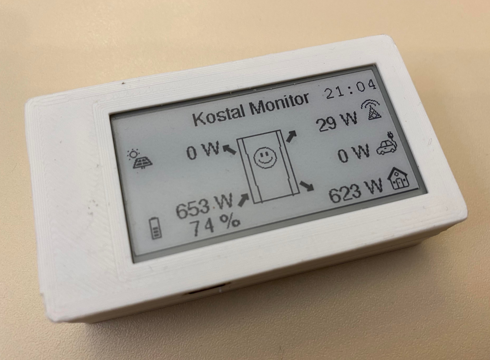

# Kostal Plenticore Converter Monitor

* PV production [W]
* Battery charge/discharge [W] and SoC of battery [%]
* House consumption [W]
* Grid consumption/generation [W]
* Time of last query

To get fast insight on power consumtion of the house, the device shows smiley depending on primary energy source:

* battery: 🙂
* PV: 😎
* grid:🙁

## Development

### TODOs & Links

* add lipo battery <https://www.az-delivery.de/blogs/azdelivery-blog-fur-arduino-und-raspberry-pi/5v-akku-stromversorgung-mit-3-7-v-lipo-akku-und-laderegler>
<https://www.bastelgarage.ch/index.php?route=extension/d_blog_module/post&post_id=14>
* <https://github.com/re-innovation/TTGO_EPaper>
* Battery Level: <https://gist.github.com/jenschr/dfc765cb9404beb6333a8ea30d2e78a1>
* <https://github.com/olikraus/U8g2_for_Adafruit_GFX>
* <https://github.com/Xinyuan-LilyGO/T5-Ink-Screen-Series>

### PlatformIO

Project is developed with [PlatformIO](https://platformio.org/).

### Modbus

Communication is based on [Kostal Plenticore Modbus](docs\BA_KOSTAL-Interface-description-MODBUS-TCP_SunSpec_Hybrid.pdf)

## Security and Best Practices

This project implements several IoT security and reliability best practices:

### Memory Safety
* **Buffer overflow protection**: All string formatting uses `snprintf()` instead of `sprintf()` to prevent buffer overflows
* **Variable initialization**: All variables are initialized before use to prevent undefined behavior
* **Input validation**: Hostname and IP addresses are validated before use

### Network Security
* **Timeout protection**: All network operations (WiFi, NTP, Modbus) have configurable timeouts to prevent infinite loops
* **Connection validation**: Remote IP addresses and hostnames are validated before attempting connections
* **Error handling**: Comprehensive error handling with informative error messages for debugging

### Power Optimization
* **Deep sleep mode**: Device enters deep sleep between readings to conserve battery
* **Conditional updates**: Display only updates during daylight hours (7 AM - 11 PM) to save power
* **Rate limiting**: Modbus queries are rate-limited to avoid overwhelming the inverter

### Reliability
* **Watchdog timers**: Transaction timeouts prevent hanging on failed communications
* **Retry logic**: NTP synchronization includes retry logic with exponential backoff
* **Error recovery**: Failed operations return safe default values instead of crashing

### Code Quality
* **Constants for magic numbers**: All magic numbers replaced with named constants for maintainability
* **Comprehensive documentation**: All functions have detailed documentation comments
* **Type safety**: Proper use of unsigned types where negative values are impossible

## Used Libraries

* adafruit/Adafruit BusIO@^1.16.1
* adafruit/Adafruit GFX Library@^1.11.11
* zinggjm/GxEPD@^3.1.5
* emelianov/modbus-esp8266@^4.1.0
* juerd/ESP-WiFiSettings@^3.8.0
* me-no-dev/AsyncTCP@^1.1.4
* olikraus/U8g2@^2.35.30
* olikraus/U8g2_for_Adafruit_GFX@^1.8.0
* arduino-libraries/NTPClient@^3.2.1
* madpilot/mDNSResolver@^0.3
* jchristensen/Timezone@^1.2.4

* vuepress: ^2.0.0-rc.18 (for documentation)

## Build Configuration

The project includes two build environments:
* **ttygo-t5** (default): Optimized release build with size optimization (-Os)
* **ttygo-t5-debug**: Debug build with verbose logging for development

## Credits

* Project was initiated on [2022 ESP32 Initiation Program: "Micro-Control" Your World](https://community.dfrobot.com/makelog-312165.html). Many thanks to [DFRobot](https://www.dfrobot.com/index.html) for the support.
* [ESP-badge](https://github.com/lewisxhe/Esp-badge): For loading bmp images.

## License

[MIT License](LICENSE)
