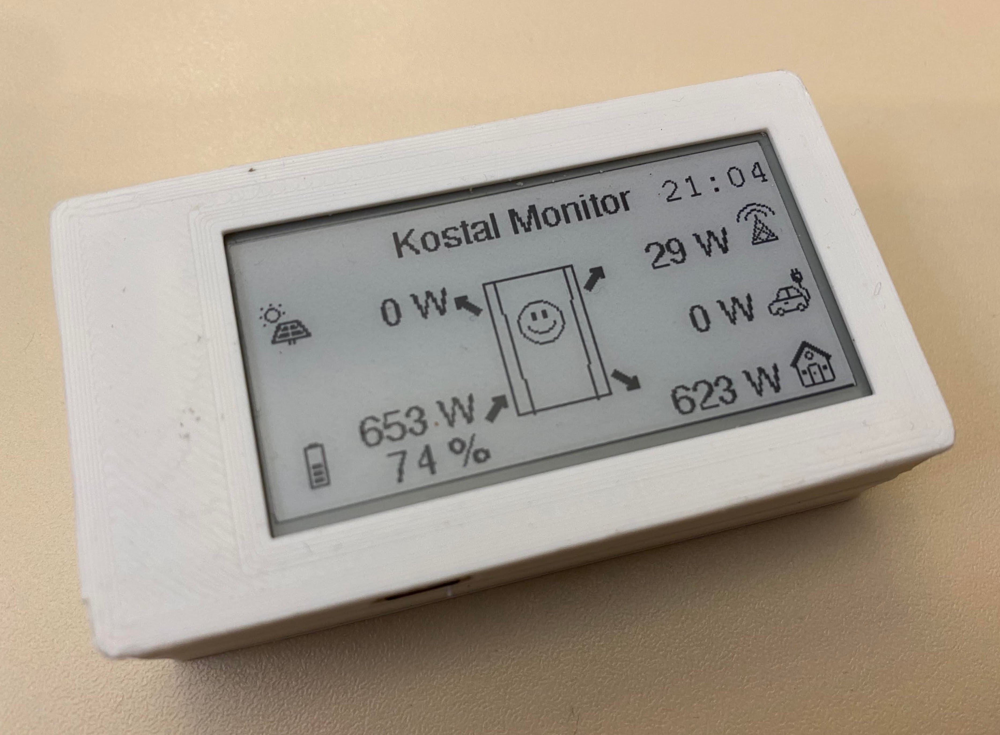

# Kostal Plenticore Converter Monitor

* PV production [W]
* Battery charge/discharge [W] and SoC of battery [%]
* House consumption [W]
* Grid consumption/generation [W]
* Time of last query

To get fast insight on power consumtion of the house, the device shows smiley depending on primary energy source:

* battery: 🙂
* PV: 😎
* grid:🙁

## Development

### TODOs & Links

* add lipo battery <https://www.az-delivery.de/blogs/azdelivery-blog-fur-arduino-und-raspberry-pi/5v-akku-stromversorgung-mit-3-7-v-lipo-akku-und-laderegler>
<https://www.bastelgarage.ch/index.php?route=extension/d_blog_module/post&post_id=14>
* <https://github.com/re-innovation/TTGO_EPaper>
* Battery Level: <https://gist.github.com/jenschr/dfc765cb9404beb6333a8ea30d2e78a1>
* <https://github.com/olikraus/U8g2_for_Adafruit_GFX>
* <https://github.com/Xinyuan-LilyGO/T5-Ink-Screen-Series>

### PlatformIO

Project is developed with [PlatformIO](https://platformio.org/).

### Modbus

Communication is based on [Kostal Plenticore Modbus](docs\BA_KOSTAL-Interface-description-MODBUS-TCP_SunSpec_Hybrid.pdf)

## Used Libraries

* adafruit/Adafruit BusIO@^1.11.2
* adafruit/Adafruit GFX Library@^1.10.13
* zinggjm/GxEPD@^3.1.1
* emelianov/modbus-esp8266@^4.0.0
* juerd/ESP-WiFiSettings@^3.8.0
* me-no-dev/AsyncTCP@^1.1.1
* olikraus/U8g2@^2.32.10
* olikraus/U8g2_for_Adafruit_GFX@^1.8.0
* arduino-libraries/NTPClient@^3.1.0

* vuepress: <https://vuepress.vuejs.org/> (for documentation)

## Credits

* Project was initiated on [2022 ESP32 Initiation Program: "Micro-Control" Your World](https://community.dfrobot.com/makelog-312165.html). Many thanks to [DFRobot](https://www.dfrobot.com/index.html) for the support.
* [ESP-badge](https://github.com/lewisxhe/Esp-badge): For loading bmp images.

## License

[MIT License](LICENSE)
